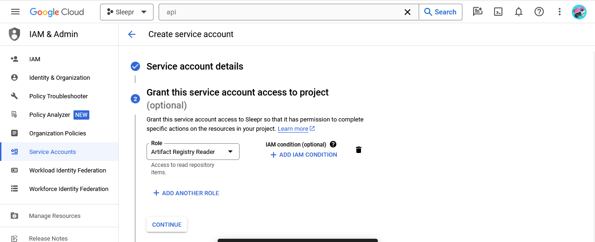
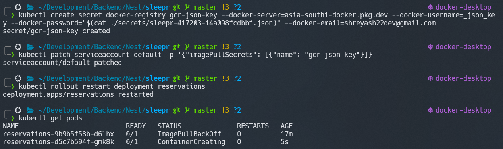
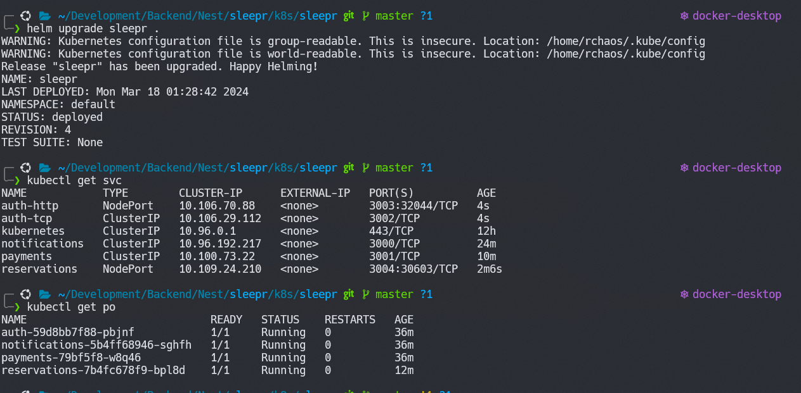

# March 14 Notes

## Payments

- payments code is pretty self-explanatory. Just read the stripe documentation.
- nested validation

```TS
  @IsDefined()
  @IsNotEmpty()
  @ValidateNested()
  @Type(() => CardDto)
  card: CardDto;
```

- This validates all the Dtos inside the CardDto as well. `@Type(() => CardDto)` is required to parse the request object as a class for the sake of validation.

## Notifications

```TS
  @EventPattern('notify_email')
```

- This basically says that the function does not expect a return type. It just runs without expecting a response

## Image Deployment

### Changes in Dockerfile

- Change dockerfile so that it is more efficient and only copies the app directory and libs directory
- Due to this users model had to be defined in `libs/common`

### Package.json refactor

- Remove the app dependencies from root package.json and add them in a newly created app package.json to make it more efficient
- Add a command to install the package.json in the app in the Dockerfile

### Pushing images to artifact registry

- do `docker build -t reservations -f ./Dockerfile ../../` to build the Dockerfile with the name `reservations`
- tag it with the artifact registry url with production by `docker tag reservation <URL>/production`
- push it to artifact registry using `docker push <URL>/production`

## Kubernetes

### Creation of Pods

- Run `helm create sleepr` inside k8s and delete all the available files in templates and clear `values.yaml`
- Use command `kubectl create deployment reservations --image=<URL>/production --dry-run=client -o yaml > deployment.yaml`
- This will create a deployment.yaml for reservations. Put it in `k8s/templates/reservations/`

### Helm install error

- `helm install sleepr .` throws error "Chart.yaml missing". Instead use `helm install sleepr k8s/sleepr` [location of the chart]
- Same thing for `helm upgrade`

### Creation of service account for kubectl to access gcloud



- Next create `keys` and download the json key

```bash
kubectl create secret docker-registry gcr-json-key --docker-server=asia-south1-docker.pkg.dev --docker-username=_json_key --docker-password="$(cat ./secrets/sleepr-417203-14a098fcdbbf.json)" --docker-email=shreyash22dev@gmail.com

```

- Use this command to generate `gcr-json-key` environment variable

```bash
kubectl patch serviceaccount default -p '{"imagePullSecrets": [{"name": "gcr-json-key"}]}'

```

- Use this command to update the default serviceaccount with the required key

- Use `kubectl rollout restart deployment reservations` to restart the deployment, `kubectl get pods` to see the running pods and their status, use `kubectl describe pods` to see the status in greater detail and use `kubectl logs <POD_NAME>` to see the logs.

### Creation of mongodb secret

```bash
kubectl create secret generic mongodb --from-literal=connectionString=<URL>
```

- use this to create a kubernetes secret
- use `kubectl get secrets` to get a list of secrets and `kubectl get secret mongodb -o yaml` to get more information about the secret.
- Do note that you can provide multiple `--from-literal` and you can think of them as this -

```JSON
{
  "mongodb": {
    "connectionString": "<URL>"
  }
}
```

### Creation of services which can be interacted by other services

```bash
kubectl create service clusterip notifications --tcp=3000 --dry-run=client -o yaml > service.yaml
```

- this will generate a `service.yaml` which should be put into `templates/notifications` so it is generated by helm
- You can see the running service using `kubectl get services`

```bash
kubectl create service nodeport reservations --tcp=3004 --dry-run=client -o yaml > service.yaml
```

- this commands make it so that this service is accessible to the web and not only internally.
- since auth has use of both internal and external connections, we have had to create two service.yaml files for it. We diffrentiate between them using the name field in metadata

## Notes

- `helm uninstall <CHAR_NAME>` removes all the running pods and services.
- If `refreshToken` expires, we can get it again from google auth playground
- `kubectl edit secret google` can be used to edit secrets. Keep in mind that it stores secret as base64 encrypted so while editing you need to add the value as base64 encoded only.
- `npm` failed us. It gave the error 'semver' not found. Using `pnpm` fixed the issue.
- Added health module for health checks just to see whether the server is running or not.

VICTORY
