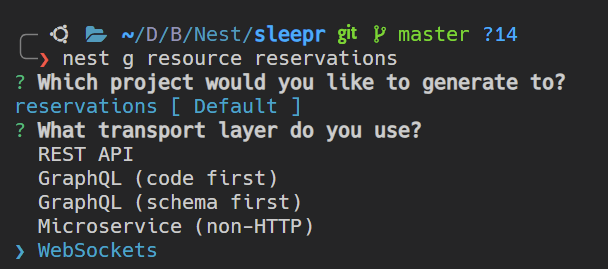

# March 5 Notes

## NestJS Microservice Architecture

- We created a common library using `nest generate library common` command in terminal.
- We created modules inside this library using `nest generate module -p common database`
- Then for creating the different apps in the microservice, we create using `nest generate app reservations`. This refactors the whole codebase so that there's no single src and test directories any more. A new apps directory is created which contains the newly created app and the global app.
- To remove the default directory, changes need to be done in package.json and nest-cli.json

## Abstract Repository

```TS
export abstract class AbstractRepository<TDocument extends AbstractDocument> {
  protected abstract readonly logger: Logger;

  constructor(protected readonly model: Model<TDocument>) {}

  async create(document: Omit<TDocument, '_id'>): Promise<TDocument> {
    const createdDocument = new this.model({
      ...document,
      _id: new Types.ObjectId(),
    });

    return (await createdDocument.save()).toJSON() as unknown as TDocument;
  }
}
```

- A very good case of OOP.
- We are creating an abstract repository that does not depend on any particular model. Typeorm creates them automatically but here, we are manually creating this.
- This is an abstract class that needs to be implemented ie all the abstract functions need to be defined and all the defined functions are already present.
- Here `TDocument` is the type of AbstractRepository such that it extends the Abstract Document Schema (it needs to contain an _id column)
- Since it extends AbstractDocument, it also inherits the functions of Schema ie save, etc.
- Now, in constructor, we define a model of type TDocument for which everything runs.
- `Omit<x, y>` is a type that basically say x with all fields except y ie document must be of type TDocument without the field "_id" as it will be created later.
- We return the response as a TDocument. (Does this have the required methods??)

## Abstract Config Module

```TS
@Module({
  imports: [
    NestConfigModule.forRoot({
      validationSchema: Joi.object({
        MONGODB_URI: Joi.string().required(),
      }),
    }),
  ],
  providers: [ConfigService],
  exports: [ConfigService],
})
```

- An abstract configmodule created to achieve abstraction
- We add a validation schema to validate the env file's contents.
- We set the providers and exports because if we are using this anywhere else then the config service should come from this module if this module is being used.

## Nest Resource

`nest generate resource reserveations` generates boilerplate code for various things like RestAPI, it's freaking awesome.


## Creating Reservations Repository

```TS
@Schema({ versionKey: false })
export class ReservationDocument extends AbstractDocument {
  @Prop()
  timestamp: Date;
}

export const ReservationSchema =
  SchemaFactory.createForClass(ReservationDocument);
```

- `versionKey: false` means that there will be no versioning for schema definitions
- `@Schema()` decorator is used to define schema definitions and not schema themselves
- SchemaFactory.createForClass() is used to create an actual Schema.
- Schema definitions are more like a class so they are used as types of model only.

```TS
@Injectable()
export class ReservationsRepository extends AbstractRepository<ReservationDocument> {
  protected readonly logger = new Logger(ReservationsRepository.name);

  constructor(
    @InjectModel(ReservationDocument.name)
    reservationModel: Model<ReservationDocument>,
  ) {
    super(reservationModel);
  }
}
```

- We inherit all the methods from the AbstractRepository and pass the Schema Definition as a parameter.
- We create a logger with the repository name for better debugging and also because it is required in the AbstractRepository definition.
- We pass the model using `super(reservationModel)` so that the functions requiring the model in the AbstractDocument do their processing on the model of the actual class.
- We inject the model using `@InjectModel` with the document name.
- This will not work as Mongoose doesnt know about the existence of the model with the name of `ReservationDocument.name`

```TS
DatabaseModule.forFeature([
  {
    name: ReservationDocument.name,
    schema: ReservationSchema,
  },
]),
```

- We add a static method `forFeature` in database module, which basically abstracts the Mongoose module function.
- This `forFeature` function creates a model with name `ReservationDocument.name` due to which now the `@InjectModel()` will not throw an error.

## Database Module Abstraction

```TS
@Module({
  imports: [
    MongooseModule.forRootAsync({
      imports: [ConfigModule],
      useFactory: (configService: ConfigService) => ({
        uri: configService.get<string>('MONGODB_URI'),
      }),
      inject: [ConfigService],
    }),
  ],
})
export class DatabaseModule {
  static forFeature(models: ModelDefinition[]) {
    return MongooseModule.forFeature(models);
  }
}
```

- The benefit of creating an abstract database module is that we dont need to define the Mongoose connection in all the apps that are in the system.

## ForFeature and ForFeatureAsync

ForFeature is used to define static data injection while ForFeatureAsync is used to define dynamic data injection ie there's some time taken to get the data for it to inject. So we need to do it asynchronously.
